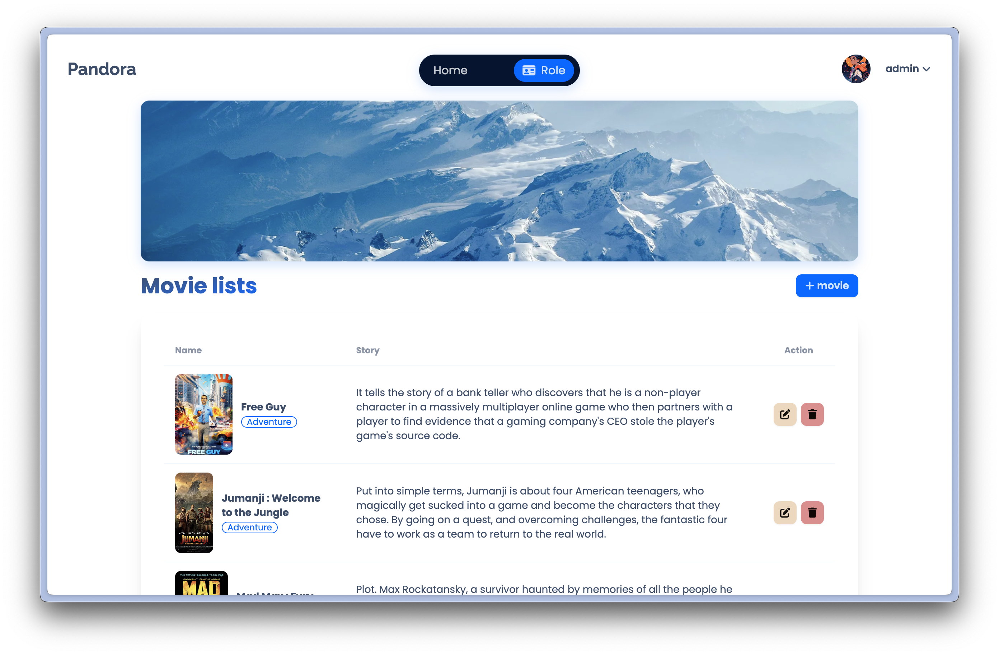

# PHP-Movie-MiniProject / Tailwind+DaisyUI

Pandora is a platform designed to meet the needs of movie lovers. With an easy and fast registration process, you can immediately select your preferred movie genres, such as Adventure, Action, Romance, Drama, Fantasy, Comedy, Sci-fi, Horror, and Animation. Once logged in, you'll find movies that match your taste displayed on the homepage, making it convenient for you to choose what to watch.

In addition to offering movies based on users' preferences, Pandora features a clear categorization system, allowing you to easily access movies of all types. For animation enthusiasts, Pandora has created a dedicated section, making it effortless for fans to find and enjoy animated content.

In terms of management, Pandora's Admin system is designed for easy and efficient content management, ensuring that the website is regularly updated and offers a seamless user experience.

Pandora is not just an online movie streaming platform; it is a place that provides a personalized movie-watching experience tailored to your tastes. Whether you're seeking excitement, fun, or emotional depth, Pandora is ready to fulfill all your entertainment needs in one place.

## How to run
- First step
```
npm install
```
- Then run
```
npm run dev
```
- And open this path on your web browser (Port : 3000)<br/>
http://localhost:3000/web-php-ass/php-movie-miniproject/src/home.php

## Design
- Home page

- The main page will be displayed after logging in.

- Admin page


## Tech Stack


## Co-developers
- [FeiZGe](https://github.com/FeiZGe)
- [Poonnys](https://github.com/Poonnys)
- [Beta](https://github.com/Nitipon556677)
- [Ponderay](https://github.com/Ponderay)
